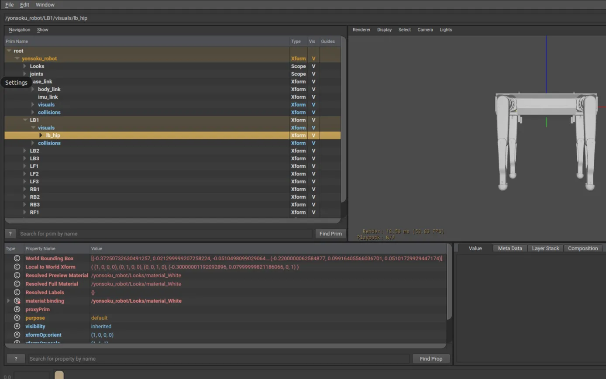

# Adding Custom Robots to Isaac Lab: From URDF to Reinforcement Learning

This guide walks through the complete process of integrating your own robot model from URDF into Isaac Lab for reinforcement learning experiments.

## Table of Contents

1. [Prerequisites](#prerequisites)
2. [Overview of the Integration Process](#overview-of-the-integration-process)
3. [Step 1: Preparing Your URDF Model](#step-1-preparing-your-urdf-model)
4. [Step 2: Converting URDF to USD](#step-2-converting-urdf-to-usd)
5. [Step 3: Creating the Robot Configuration](#step-3-creating-the-robot-configuration)
6. [Step 4: Creating the Environment Configuration](#step-4-creating-the-environment-configuration)
7. [Step 5: Implementing the Environment](#step-5-implementing-the-environment)
8. [Step 6: Registering the Environment](#step-6-registering-the-environment)
9. [Step 7: Setting Up Agent Configurations](#step-7-setting-up-agent-configurations)
10. [Step 8: Testing and Training](#step-8-testing-and-training)
11. [Troubleshooting Common Issues](#troubleshooting-common-issues)
12. [Advanced Customization](#advanced-customization)

## Prerequisites

Before starting the integration process, ensure you have:

- A working Isaac Lab installation
- A valid URDF file for your robot
- All referenced mesh files (STL, OBJ, COLLADA, etc.)
- Knowledge of your robot's joint structure and control parameters

## Overview of the Integration Process

Integrating a custom robot into Isaac Lab involves several key steps:

1. Preparing the URDF model and associated meshes
2. Converting the URDF to USD format (Isaac Lab's native format)
3. Creating a robot configuration in Python
4. Defining an environment configuration
5. Implementing the reinforcement learning environment
6. Registering the environment with Gym
7. Setting up agent configurations for different RL frameworks
8. Testing and training the robot

## Step 1: Preparing Your URDF Model

### Organizing Files

First, create a directory structure for your robot:

```bash
mkdir -p source/isaaclab_rl_experiments/isaaclab_rl_experiments/assets/robots/YOUR_ROBOT_NAME
mkdir -p source/isaaclab_rl_experiments/isaaclab_rl_experiments/assets/robots/YOUR_ROBOT_NAME/meshes
mkdir -p source/isaaclab_rl_experiments/isaaclab_rl_experiments/assets/robots/YOUR_ROBOT_NAME/urdf
```

### Adapting Your URDF

Copy your URDF file and mesh files to the appropriate directories:

```bash
cp path/to/your/robot.urdf source/isaaclab_rl_experiments/isaaclab_rl_experiments/assets/robots/YOUR_ROBOT_NAME/urdf/
cp -r path/to/your/meshes/* source/isaaclab_rl_experiments/isaaclab_rl_experiments/assets/robots/YOUR_ROBOT_NAME/meshes/
```

### URDF Best Practices

For optimal conversion to USD:

- Ensure all mesh paths are valid and use relative paths or package:// URIs
- Verify that all links have appropriate inertial properties
- Make sure joint limits are properly defined
- Check that collision geometries are properly defined
- Avoid complex mesh structures for collision geometries where possible

## Step 2: Converting URDF to USD

Isaac Lab provides a built-in tool for converting URDF files to USD format:

```bash
./isaaclab.sh -p IsaacLab/scripts/tools/convert_urdf.py \
  source/isaaclab_rl_experiments/isaaclab_rl_experiments/assets/robots/YOUR_ROBOT_NAME/urdf/robot.urdf \
  source/isaaclab_rl_experiments/isaaclab_rl_experiments/assets/robots/YOUR_ROBOT_NAME/robot.usd \
  --merge-joints \
  --joint-stiffness <YOUR_STIFFNESS_VALUE> \
  --joint-damping <YOUR_DAMPING_VALUE> \
  --joint-target-type position
```

### Conversion Parameters

- `--merge-joints`: Consolidates links connected by fixed joints
- `--joint-stiffness`: Sets joint drive stiffness (match to your robot's controller)
- `--joint-damping`: Sets joint drive damping (match to your robot's controller)
- `--joint-target-type`: Choose between "position", "velocity", or "none"
- `--fix-base`: Optional flag to fix the base in place

### Verifying the Conversion

After conversion, check that the USD file has been created correctly:

1. The file exists at the specified output path  
2. The joint structure matches your URDF  
3. The mesh assets are properly referenced  

For visual inspection, you can open the USD file in Isaac Sim's UI.

### Checking USD with usdview

To inspect your USD file in `usdview`, first install it via NVIDIA Omniverse.

Extract the binary packages if necessary and launch:
```bash
# Run the usdview GUI script on your USD model
./usdview_gui.sh /home/dl-box/codes/anhar/isaaclab_rl_experiments/assets/robots/YOUR_ROBOT_NAME/robot.usd
```


### Running the Prim Listing Script

You can also programmatically list all prims in the stage with a simple Python script. Create `scripts/test_yonsoku_usd.py` (if not already present) and run:
```bash
python scripts/test_yonsoku_usd.py /path/to/yonsoku_robot.usd
```
Example output:
```
Available prims in the stage:
  - /yonsoku_robot
  - /yonsoku_robot/Looks
  - /yonsoku_robot/Looks/material_Black
  - /yonsoku_robot/Looks/material_Black/Shader
  - /yonsoku_robot/Looks/material_White
  - /yonsoku_robot/Looks/material_White/Shader
  - /yonsoku_robot/Looks/DefaultMaterial
  - /yonsoku_robot/Looks/DefaultMaterial/DefaultMaterial
  - /yonsoku_robot/Looks/DefaultMaterial_0
  - /yonsoku_robot/Looks/DefaultMaterial_0/DefaultMaterial
  - /yonsoku_robot/Looks/DefaultMaterial_1
  - /yonsoku_robot/Looks/DefaultMaterial_1/DefaultMaterial
  - /yonsoku_robot/joints
  - /yonsoku_robot/joints/LB_JOINT1
  - /yonsoku_robot/joints/LB_JOINT2
  - /yonsoku_robot/joints/LB_JOINT3
  - /yonsoku_robot/joints/LF_JOINT1
  - /yonsoku_robot/joints/LF_JOINT2
  - /yonsoku_robot/joints/LF_JOINT3
  - /yonsoku_robot/joints/RB_JOINT1
  - /yonsoku_robot/joints/RB_JOINT2
  - /yonsoku_robot/joints/RB_JOINT3
  - /yonsoku_robot/joints/RF_JOINT1
  - /yonsoku_robot/joints/RF_JOINT2
  - /yonsoku_robot/joints/RF_JOINT3
  - /yonsoku_robot/base_link
  - /yonsoku_robot/base_link/body_link
  - /yonsoku_robot/base_link/body_link/LB_FOOT
  - /yonsoku_robot/base_link/body_link/LF_FOOT
  - /yonsoku_robot/base_link/body_link/RB_FOOT
  - /yonsoku_robot/base_link/body_link/RF_FOOT
  - /yonsoku_robot/base_link/imu_link
  - /yonsoku_robot/base_link/visuals
  - /yonsoku_robot/base_link/collisions
  - /yonsoku_robot/LB1
  - /yonsoku_robot/LB1/visuals
  - /yonsoku_robot/LB1/collisions
  - /yonsoku_robot/LB2
  - /yonsoku_robot/LB2/visuals
  - /yonsoku_robot/LB2/collisions
  - /yonsoku_robot/LB3
  - /yonsoku_robot/LB3/visuals
  - /yonsoku_robot/LB3/collisions
  - /yonsoku_robot/LF1
  - /yonsoku_robot/LF1/visuals
  - /yonsoku_robot/LF1/collisions
  - /yonsoku_robot/LF2
  - /yonsoku_robot/LF2/visuals
  - /yonsoku_robot/LF2/collisions
  - /yonsoku_robot/LF3
  - /yonsoku_robot/LF3/visuals
  - /yonsoku_robot/LF3/collisions
  - /yonsoku_robot/RB1
  - /yonsoku_robot/RB1/visuals
  - /yonsoku_robot/RB1/collisions
  - /yonsoku_robot/RB2
  - /yonsoku_robot/RB2/visuals
  - /yonsoku_robot/RB2/collisions
  - /yonsoku_robot/RB3
  - /yonsoku_robot/RB3/visuals
  - /yonsoku_robot/RB3/collisions
  - /yonsoku_robot/RF1
  - /yonsoku_robot/RF1/visuals
  - /yonsoku_robot/RF1/collisions
  - /yonsoku_robot/RF2
  - /yonsoku_robot/RF2/visuals
  - /yonsoku_robot/RF2/collisions
  - /yonsoku_robot/RF3
  - /yonsoku_robot/RF3/visuals
  - /yonsoku_robot/RF3/collisions
  - /OmniverseKit_Persp
  - /OmniverseKit_Front
  - /OmniverseKit_Top
  - /OmniverseKit_Right
  - /Render
  - /Render/OmniverseKit
  - /Render/OmniverseKit/HydraTextures
  - /Render/OmniverseKit/HydraTextures/omni_kit_widget_viewport_ViewportTexture_0
  - /Render/Vars
  - /Render/Vars/LdrColor
```

This indicates your robot name is yonsoku_robot.

### Troubleshooting Conversion Issues

Common issues during conversion include:

1. **Mesh Path Resolution**: If meshes can't be found, try using absolute paths or moving meshes to a more accessible location
2. **Collision Geometry Errors**: Simplify complex collision geometries or replace them with primitive shapes
3. **Null Prim Errors**: These often indicate issues with link references or mesh paths
4. **Joint Limit Issues**: Ensure joint limits in the URDF are correctly specified

If conversion fails, try these approaches:

```bash
# Try without optional parameters first
./isaaclab.sh -p scripts/tools/convert_urdf.py \
  source/isaaclab_rl_experiments/isaaclab_rl_experiments/assets/robots/YOUR_ROBOT_NAME/urdf/robot.urdf \
  source/isaaclab_rl_experiments/isaaclab_rl_experiments/assets/robots/YOUR_ROBOT_NAME/robot.usd

# If mesh paths are problematic, modify the URDF to use absolute paths
sed -i 's|package://your_package/meshes|/absolute/path/to/meshes|g' your_robot.urdf
```

## Step 3: Creating the Robot Configuration

Create a Python configuration file for your robot:

```bash
mkdir -p source/isaaclab_rl_experiments/isaaclab_rl_experiments/assets/robots/YOUR_ROBOT_NAME
touch source/isaaclab_rl_experiments/isaaclab_rl_experiments/assets/robots/YOUR_ROBOT_NAME/robot_config.py
```

Add the following content, adapting it to your robot's specifications:

```python
# Copyright (c) 2022-2025, The Isaac Lab Project Developers.
# All rights reserved.
#
# SPDX-License-Identifier: BSD-3-Clause

"""Your robot configuration for Isaac Lab."""

from isaaclab.assets import ArticulationCfg
from isaaclab.actuators import ImplicitActuatorCfg
from isaaclab.sim.spawners.from_files import UsdFileCfg
from isaaclab.utils import configclass
from isaaclab.sim.schemas import RigidBodyPropertiesCfg, ArticulationRootPropertiesCfg

# Define path to your robot USD model
_USD_PATH = "/path/to/your/robot.usd"

# Create a simple configuration class for the initial state
@configclass
class InitState:
    joint_pos = {
        # Define default joint positions for all joints
        # Example for a quadruped with 3 joints per leg:
        "RF_JOINT1": 0.0,
        "RF_JOINT2": 1.57,  # 90 degrees in radians
        "RF_JOINT3": -2.88,  # -165 degrees in radians
        # ... add all other joints
    }
    joint_vel = {}  # Initialize with zero velocities
    pos = [0.0, 0.0, 0.52]  # Starting height above ground
    rot = [1.0, 0.0, 0.0, 0.0]  # Quaternion [w, x, y, z]
    lin_vel = [0.0, 0.0, 0.0]  # Linear velocity
    ang_vel = [0.0, 0.0, 0.0]  # Angular velocity

# Create the articulation configuration
YOUR_ROBOT_CFG = ArticulationCfg(
    prim_path="/World/envs/env_.*/your_robot_name",
    # Use spawn with UsdFileCfg to properly load the USD file
    spawn=UsdFileCfg(
        usd_path=_USD_PATH,
        rigid_props=RigidBodyPropertiesCfg(
            enable_gyroscopic_forces=True,
            max_depenetration_velocity=100.0,
        ),
        articulation_props=ArticulationRootPropertiesCfg(
            solver_position_iteration_count=4,
            solver_velocity_iteration_count=0,
            sleep_threshold=0.005,
            stabilization_threshold=0.001,
        ),
        activate_contact_sensors=True,
    ),
    # Define actuators with appropriate configs
    actuators={
        # Use regular expressions to group similar joints
        "RF_JOINT[1-3]": ImplicitActuatorCfg(
            joint_names_expr="RF_JOINT[1-3]",
            stiffness=2000.0,
            damping=20.1,
            effort_limit_sim=2000.0
        ),
        # ... define actuators for all joints
    },
    # Use our custom InitState class
    init_state=InitState(),
)
```

### Considerations for Robot Configuration

- Set appropriate joint control parameters based on your robot's dynamics
- Default joint positions should reflect a stable starting pose
- Root position should place the robot at an appropriate height above the ground
- Adjust stiffness and damping values to match your robot's controllers
- Use regular expressions to group similar joints where appropriate (e.g., "RF_JOINT[1-3]")

## Step 4: Creating the Environment Configuration

Create the directory structure for your environment:

```bash
mkdir -p source/isaaclab_rl_experiments/isaaclab_rl_experiments/tasks/direct/your_robot_name
```

Create an environment configuration file:

```bash
touch source/isaaclab_rl_experiments/isaaclab_rl_experiments/tasks/direct/your_robot_name/your_robot_env_cfg.py
```

Add the following content:

```python
# Copyright (c) 2022-2025, The Isaac Lab Project Developers.
# All rights reserved.
#
# SPDX-License-Identifier: BSD-3-Clause

"""Environment configuration for your robot in Isaac Lab."""

import math
import numpy as np

from isaaclab.envs import DirectRLEnvCfg
from isaaclab.scene import InteractiveSceneCfg
from isaaclab.sim import SimulationCfg
from isaaclab.utils import configclass

from isaaclab_rl_experiments.assets.robots.your_robot_name.robot_config import YOUR_ROBOT_CFG

@configclass
class YourRobotEnvCfg(DirectRLEnvCfg):
    """Environment configuration for your robot."""
    
    # Simulation parameters
    decimation = 4
    episode_length_s = 20.0
    
    # Robot configuration
    robot_cfg = YOUR_ROBOT_CFG
    
    # Simulation setup
    sim = SimulationCfg(dt=1/120.0, render_interval=decimation)
    
    # Scene configuration
    scene = InteractiveSceneCfg(num_envs=4096, env_spacing=5.0, replicate_physics=True)
    
    # Observation and action spaces - dimensions will be calculated in the environment
    observation_space = 48  # Example: base state + joint state + previous actions + commands
    action_space = 12       # Example: 12 joint positions (3 joints per leg for quadruped)
    state_space = 0
    
    # Define joint names for easy access
    leg_joint_names = {
        "RF": ["RF_JOINT1", "RF_JOINT2", "RF_JOINT3"],
        "RB": ["RB_JOINT1", "RB_JOINT2", "RB_JOINT3"],
        "LB": ["LB_JOINT1", "LB_JOINT2", "LB_JOINT3"],
        "LF": ["LF_JOINT1", "LF_JOINT2", "LF_JOINT3"]
    }
    
    # Control parameters
    action_scale = 1.0
    
    # Reward scales for different components
    reward_scales = {
        "tracking_lin_vel": 1.0,     # Linear velocity tracking
        "tracking_ang_vel": 0.5,     # Angular velocity tracking
        "lin_vel_z": -2.0,           # Penalty for vertical velocity
        "ang_vel_xy": -0.05,         # Penalty for roll/pitch rates
        "base_height": -3.0,         # Penalty for incorrect base height
        "joint_regularization": -0.001,  # Penalty for extreme joint positions
        "action_rate": -0.01,        # Penalty for sudden action changes
        "feet_air_time": 2.0,        # Reward for proper gait timing
    }
    
    # Initial randomization
    start_position_noise = 0.0
    start_rotation_noise = 0.0
    
    # Termination conditions
    termination_height = 0.25
    termination_roll = 1.57   # ~90 degrees
    termination_pitch = 1.57  # ~90 degrees
    
    # Command ranges
    command_x_range = [-1.0, 1.0]
    command_y_range = [-1.0, 1.0]
    command_yaw_range = [-1.0, 1.0]
```

### Environment Configuration Considerations

- Adjust `decimation` and `episode_length_s` based on your task requirements
- Set appropriate `num_envs` based on your GPU capabilities
- Define a clear organization of joint names for easy access
- Fine-tune reward scales to shape the desired behavior
- Set appropriate command ranges based on your robot's capabilities

## Step 5: Implementing the Environment

Create an environment implementation file:

```bash
touch source/isaaclab_rl_experiments/isaaclab_rl_experiments/tasks/direct/your_robot_name/your_robot_env.py
```

Add the following implementation (based on a velocity control task):

```python
# Copyright (c) 2022-2025, The Isaac Lab Project Developers.
# All rights reserved.
#
# SPDX-License-Identifier: BSD-3-Clause

"""Environment implementation for your robot in Isaac Lab."""

from collections.abc import Sequence
import math
import torch
from typing import Dict, Optional, Tuple, Union

import isaaclab.sim as sim_utils
from isaaclab.assets import Articulation
from isaaclab.envs import DirectRLEnv
from isaaclab.sim.spawners.from_files import GroundPlaneCfg, spawn_ground_plane
from isaaclab.utils.math import quat_rotate_inverse, sample_uniform

from .your_robot_env_cfg import YourRobotEnvCfg


class YourRobotEnv(DirectRLEnv):
    """Your robot environment in Isaac Lab."""
    
    cfg: YourRobotEnvCfg
    
    def __init__(self, cfg: YourRobotEnvCfg, render_mode: Optional[str] = None, **kwargs):
        """Initialize the environment."""
        super().__init__(cfg, render_mode, **kwargs)
        
        self.dt = self.cfg.sim.dt
        
        # Extract joint indices 
        self.dof_indices = {}
        for leg_name, joint_names in self.cfg.leg_joint_names.items():
            indices, names = self.robot.find_joints(joint_names)
            self.dof_indices[leg_name] = indices
        
        # Flatten all joint indices
        self.all_dof_indices = []
        for indices in self.dof_indices.values():
            self.all_dof_indices.extend(indices)
        
        # Command values (velocity targets)
        self.commands = torch.zeros(self.num_envs, 3, device=self.device)
        
        # Command ranges
        self.command_ranges = torch.tensor(
            [
                self.cfg.command_x_range,
                self.cfg.command_y_range,
                self.cfg.command_yaw_range,
            ],
            device=self.device,
        )
        
        # Setup feet contact tracking
        self.feet_names = ["RF3", "RB3", "LB3", "LF3"]  # Last link of each leg
        self.feet_indices = []
        for name in self.feet_names:
            self.feet_indices.append(self.robot.find_bodies(name)[0])
        
        self.feet_air_time = torch.zeros((self.num_envs, len(self.feet_names)), device=self.device)
        self.last_contacts = torch.zeros((self.num_envs, len(self.feet_names)), device=self.device)
        
        # Store default joint positions
        self.default_dof_pos = self.robot.data.default_joint_pos.clone()
        
        # Save previous actions
        self.actions = torch.zeros((self.num_envs, self.cfg.action_space), device=self.device)
        self.last_actions = torch.zeros((self.num_envs, self.cfg.action_space), device=self.device)
    
    def _setup_scene(self):
        """Set up the simulation scene."""
        # Create robot - use environment pattern
        self.robot = Articulation(self.cfg.robot_cfg.replace(prim_path="/World/envs/env_.*/your_robot_name"))

        # Add ground plane
        spawn_ground_plane(prim_path="/World/ground", cfg=GroundPlaneCfg())
        
        # Clone environments
        self.scene.clone_environments(copy_from_source=False)
        
        # Add articulation to scene
        self.scene.articulations["robot"] = self.robot
        
        # Add lights
        light_cfg = sim_utils.DomeLightCfg(intensity=2000.0, color=(0.8, 0.8, 0.8))
        light_cfg.func("/World/Light", light_cfg)
    
    def _pre_physics_step(self, actions: torch.Tensor) -> None:
        """Prepare for physics step by applying actions."""
        self.last_actions = self.actions.clone()
        self.actions = actions.clone()
        
        # Scale actions to joint position targets
        scaled_actions = actions * self.cfg.action_scale
        
        # Apply joint position targets
        self.robot.set_joint_position_target(scaled_actions, joint_ids=self.all_dof_indices)
    
    def _get_observations(self) -> Dict[str, torch.Tensor]:
        """Get observations from the environment."""
        # Get robot state
        joint_pos = self.robot.data.joint_pos
        joint_vel = self.robot.data.joint_vel
        
        # Access individual components from body_state_w
        base_pos = self.robot.data.body_state_w[:, 0, 0:3]
        base_quat = self.robot.data.body_state_w[:, 0, 3:7]
        base_lin_vel = self.robot.data.body_state_w[:, 0, 7:10]
        base_ang_vel = self.robot.data.body_state_w[:, 0, 10:13]
        
        # Convert base velocity to base frame
        base_lin_vel_local = quat_rotate_inverse(base_quat, base_lin_vel)
        base_ang_vel_local = quat_rotate_inverse(base_quat, base_ang_vel)
        
        # Compose observations
        obs = torch.cat(
            [
                base_lin_vel_local,  # 3
                base_ang_vel_local,  # 3
                joint_pos,  # 12
                joint_vel,  # 12
                self.actions,  # 12
                self.commands,  # 3
            ],
            dim=-1,
        )
        
        return {"policy": obs}
    
    def _get_rewards(self) -> torch.Tensor:
        """Calculate rewards."""
        # Access individual components from body_state_w
        base_pos = self.robot.data.body_state_w[:, 0, 0:3]
        base_quat = self.robot.data.body_state_w[:, 0, 3:7]
        base_lin_vel = self.robot.data.body_state_w[:, 0, 7:10]
        base_ang_vel = self.robot.data.body_state_w[:, 0, 10:13]
        
        # Convert base velocity to base frame
        base_lin_vel_local = quat_rotate_inverse(base_quat, base_lin_vel)
        base_ang_vel_local = quat_rotate_inverse(base_quat, base_ang_vel)
        
        # Calculate tracking reward components
        lin_vel_error = torch.sum(torch.square(self.commands[:, :2] - base_lin_vel_local[:, :2]), dim=1)
        ang_vel_error = torch.square(self.commands[:, 2] - base_ang_vel_local[:, 2])
        
        # Joint regularization and action rate penalties
        joint_penalty = torch.sum(torch.square(self.robot.data.joint_pos), dim=1)
        action_rate_penalty = torch.sum(torch.square(self.actions - self.last_actions), dim=1)
        
        # Calculate reward components
        rewards = dict()
        rewards["tracking_lin_vel"] = torch.exp(-lin_vel_error / 0.25) * self.cfg.reward_scales["tracking_lin_vel"]
        rewards["tracking_ang_vel"] = torch.exp(-ang_vel_error / 0.25) * self.cfg.reward_scales["tracking_ang_vel"]
        rewards["lin_vel_z"] = torch.square(base_lin_vel_local[:, 2]) * self.cfg.reward_scales["lin_vel_z"]
        rewards["ang_vel_xy"] = torch.sum(torch.square(base_ang_vel_local[:, :2]), dim=1) * self.cfg.reward_scales["ang_vel_xy"]
        rewards["joint_regularization"] = joint_penalty * self.cfg.reward_scales["joint_regularization"]
        rewards["action_rate"] = action_rate_penalty * self.cfg.reward_scales["action_rate"]
        rewards["base_height"] = torch.square(base_pos[:, 2] - 0.52) * self.cfg.reward_scales["base_height"]
        
        # Calculate feet air time rewards
        # In a full implementation, you'd track foot contacts properly
        rewards["feet_air_time"] = torch.mean(
            torch.minimum(self.feet_air_time, torch.ones_like(self.feet_air_time) * 0.5), dim=1
        ) * self.cfg.reward_scales["feet_air_time"]
        
        # Sum all rewards
        total_reward = torch.zeros_like(rewards["tracking_lin_vel"])
        for name, value in rewards.items():
            total_reward += value
        
        return total_reward
    
    def _get_dones(self) -> Tuple[torch.Tensor, torch.Tensor]:
        """Determine if episodes should terminate."""
        # Access individual components from body_state_w
        base_pos = self.robot.data.body_state_w[:, 0, 0:3]
        base_quat = self.robot.data.body_state_w[:, 0, 3:7]
        
        # Check for termination conditions
        base_height = base_pos[:, 2]
        
        # Check orientation based on quaternion
        qx, qy, qz, qw = base_quat[:, 0], base_quat[:, 1], base_quat[:, 2], base_quat[:, 3]
        
        # Calculate roll (x-axis rotation) and pitch (y-axis rotation)
        roll = torch.atan2(2 * (qw * qx + qy * qz), 1 - 2 * (qx * qx + qy * qy))
        pitch = torch.asin(2 * (qw * qy - qz * qx))
        
        # Check termination conditions
        too_low = base_height < self.cfg.termination_height
        roll_pitch_limit = torch.abs(roll) > self.cfg.termination_roll
        roll_pitch_limit = roll_pitch_limit | (torch.abs(pitch) > self.cfg.termination_pitch)
        
        # Check timeout condition
        time_out = self.episode_length_buf >= self.max_episode_length - 1
        
        # Combine termination conditions
        terminated = too_low | roll_pitch_limit
        
        return terminated, time_out
    
    def _reset_idx(self, env_ids: Optional[Sequence[int]] = None):
        """Reset environments with the given indices."""
        if env_ids is None:
            env_ids = torch.arange(self.num_envs, device=self.device)
        
        # Call parent reset
        super()._reset_idx(env_ids)
        
        # Reset commands
        self._resample_commands(env_ids)
        
        # Reset air time tracking
        self.feet_air_time[env_ids] = 0.0
        self.last_contacts[env_ids] = 0.0
        
        # Get default root states from config's init_state
        default_root_pos = torch.tensor([self.cfg.robot_cfg.init_state.pos], 
                                device=self.device).repeat(len(env_ids), 1)
        default_root_quat = torch.tensor([self.cfg.robot_cfg.init_state.rot], 
                                 device=self.device).repeat(len(env_ids), 1)
        default_root_lin_vel = torch.zeros_like(default_root_pos)
        default_root_ang_vel = torch.zeros_like(default_root_pos)
        
        # Apply position and rotation noise if configured
        # ... implementation details omitted for brevity ...
        
        # Set environment origins
        default_root_pos += self.scene.env_origins[env_ids]
        
        # Reset joint positions
        default_joint_pos = self.default_dof_pos[env_ids].clone()
        default_joint_vel = torch.zeros_like(default_joint_pos)
        
        # Write robot state to simulation
        self.robot.write_root_pose_to_sim(
            torch.cat([default_root_pos, default_root_quat], dim=1), 
            env_ids
        )
        self.robot.write_root_velocity_to_sim(
            torch.cat([default_root_lin_vel, default_root_ang_vel], dim=1), 
            env_ids
        )
        self.robot.write_joint_state_to_sim(default_joint_pos, default_joint_vel, None, env_ids)
    
    def _resample_commands(self, env_ids: Union[torch.Tensor, Sequence[int]]):
        """Resample commands for the specified environments."""
        # Create random commands within the specified ranges
        self.commands[env_ids, 0] = sample_uniform(
            self.command_ranges[0, 0], self.command_ranges[0, 1], (len(env_ids),), self.device
        )
        self.commands[env_ids, 1] = sample_uniform(
            self.command_ranges[1, 0], self.command_ranges[1, 1], (len(env_ids),), self.device
        )
        self.commands[env_ids, 2] = sample_uniform(
            self.command_ranges[2, 0], self.command_ranges[2, 1], (len(env_ids),), self.device
        )
```

### Environment Implementation Considerations

- Implement proper observation and reward functions based on your task
- Define a clear reward structure with individual components for different goals
- Use appropriate termination conditions to detect failures
- Implement randomization for better generalization if needed
- Take advantage of vectorized operations with PyTorch for efficiency

## Step 6: Registering the Environment

Create an initialization file to register your environment:

```bash
touch source/isaaclab_rl_experiments/isaaclab_rl_experiments/tasks/direct/your_robot_name/__init__.py
```

Add the following content:

```python
# Copyright (c) 2022-2025, The Isaac Lab Project Developers.
# All rights reserved.
#
# SPDX-License-Identifier: BSD-3-Clause

"""Register your robot environment with Gym."""

import gymnasium as gym

from . import agents

##
# Register Gym environments.
##

gym.register(
    id="Isaac-YourRobot-v0",
    entry_point=f"{__name__}.env:YourRobotEnv",
    disable_env_checker=True,
    kwargs={
        "env_cfg_entry_point": f"{__name__}.env_cfg:YourRobotEnvCfg",
        "rl_games_cfg_entry_point": f"{agents.__name__}:rl_games_ppo_cfg.yaml",
        "rsl_rl_cfg_entry_point": f"{agents.__name__}.rsl_rl_ppo_cfg:PPORunnerCfg",
        "skrl_cfg_entry_point": f"{agents.__name__}:skrl_ppo_cfg.yaml",
        "sb3_cfg_entry_point": f"{agents.__name__}:sb3_ppo_cfg.yaml",
    },
)
```

## Step 7: Setting Up Agent Configurations

Create a directory for agent configurations:

```bash
mkdir -p source/isaaclab_rl_experiments/isaaclab_rl_experiments/tasks/direct/your_robot_name/agents
```

Create an initialization file:

```bash
touch source/isaaclab_rl_experiments/isaaclab_rl_experiments/tasks/direct/your_robot_name/agents/__init__.py
```

Add the following content:

```python
# Copyright (c) 2022-2025, The Isaac Lab Project Developers.
# All rights reserved.
#
# SPDX-License-Identifier: BSD-3-Clause
```

Now create configuration files for different RL frameworks:

### RL-Games Configuration

```bash
touch source/isaaclab_rl_experiments/isaaclab_rl_experiments/tasks/direct/your_robot_name/agents/rl_games_ppo_cfg.yaml
```

Add appropriate configuration.

### RSL-RL Configuration

```bash
touch source/isaaclab_rl_experiments/isaaclab_rl_experiments/tasks/direct/your_robot_name/agents/rsl_rl_ppo_cfg.py
```

Add appropriate configuration.

### Stable-Baselines3 Configuration

```bash
touch source/isaaclab_rl_experiments/isaaclab_rl_experiments/tasks/direct/your_robot_name/agents/sb3_ppo_cfg.yaml
```

Add appropriate configuration.

### SKRL Configuration

```bash
touch source/isaaclab_rl_experiments/isaaclab_rl_experiments/tasks/direct/your_robot_name/agents/skrl_ppo_cfg.yaml
```

Add appropriate configuration.

## Step 8: Testing and Training

### Installing Your Extension

Install your extension in editable mode:

```bash
python -m pip install -e source/isaaclab_rl_experiments
```

### Verifying Registration

Check that your environment is registered:

```bash
python scripts/list_envs.py
```

You should see your environment listed.

### Training Your Robot

Train your robot using the available training scripts:

```bash
# Train using RSL-RL (recommended for locomotion)
python scripts/rsl_rl/train.py --task=Isaac-YourRobot-v0 --num_envs=2048 --headless

# Or use other frameworks
# RL-Games
python scripts/rl_games/train.py --task=Isaac-YourRobot-v0 --num_envs=2048

# Stable-Baselines3
python scripts/sb3/train.py --task=Isaac-YourRobot-v0 --num_envs=1024

# SKRL
python scripts/skrl/train.py --task=Isaac-YourRobot-v0 --num_envs=2048 --algorithm=PPO
```

### Evaluating Your Trained Model

After training, evaluate your model:

```bash
# Evaluate with RSL-RL
python scripts/rsl_rl/play.py --task=Isaac-YourRobot-v0 --num_envs=16 --checkpoint=logs/rsl_rl/your_robot/<timestamp>/model_<iteration>.pt --video
```

## Troubleshooting Common Issues

### URDF Conversion Issues

#### Missing Mesh Files

If mesh files can't be found:

```bash
# Use absolute paths in your URDF
sed -i 's|package://your_robot/meshes|/absolute/path/to/meshes|g' robot.urdf
```

#### Collision Geometry Errors

If collision geometries cause issues:

1. Simplify collision geometries to primitive shapes (boxes, cylinders, spheres)
2. Check for degenerate meshes (zero volume, inverted normals)
3. Ensure collision meshes are watertight

#### Joint Limit Issues

If joint limits cause problems:

1. Ensure joint limits in URDF are correctly specified
2. Check for inconsistent upper/lower limits

### Environment Issues

#### Physics Stability

If physics simulation is unstable:

1. Adjust joint stiffness and damping values
2. Increase simulation substeps
3. Ensure inertia matrices are positive definite

#### Observation/Action Space Errors

If you encounter dimension mismatch errors:

1. Double-check observation and action space dimensions
2. Ensure all tensors have the correct shape

## Advanced Customization

### Creating Complex Reward Functions

For more sophisticated tasks, implement complex reward functions:

```python
def _get_rewards(self) -> torch.Tensor:
    """Calculate rewards."""
    # Extract relevant states
    base_pos = self.robot.data.root_state[:, :3]
    base_vel = self.robot.data.root_state[:, 7:10]
    
    # Calculate reward components
    tracking_reward = torch.exp(-torch.sum(torch.square(self.target_vel - base_vel[:, :2]), dim=1))
    energy_penalty = -torch.sum(torch.square(self.actions), dim=1) * 0.01
    
    # Combine rewards
    total_reward = tracking_reward + energy_penalty
    
    return total_reward
```

### Adding Domain Randomization

To improve sim-to-real transfer, add domain randomization:

```python
def _reset_idx(self, env_ids: Sequence[int] = None):
    """Reset environments with domain randomization."""
    super()._reset_idx(env_ids)
    
    # Randomize physics parameters
    self.robot.set_joint_friction_coefficients(
        torch.rand((len(env_ids), len(self.dof_indices)), device=self.device) * 0.5 + 0.5
    )
    
    # Randomize mass properties
    mass_scale = torch.rand(len(env_ids), device=self.device) * 0.2 + 0.9  # ±10%
    self.robot.set_masses(self.default_masses[env_ids] * mass_scale.unsqueeze(1))
```

### Custom Observation Processing

For more sophisticated observation processing:

```python
def _get_observations(self) -> Dict[str, torch.Tensor]:
    """Get observations with preprocessing."""
    # Get raw states
    joint_pos = self.robot.data.joint_pos
    joint_vel = self.robot.data.joint_vel
    
    # Apply observation normalization
    norm_joint_pos = (joint_pos - self.joint_means) / self.joint_stds
    norm_joint_vel = joint_vel / self.joint_vel_scale
    
    # Compose observation
    obs = torch.cat([norm_joint_pos, norm_joint_vel], dim=1)
    
    return {"policy": obs}
```